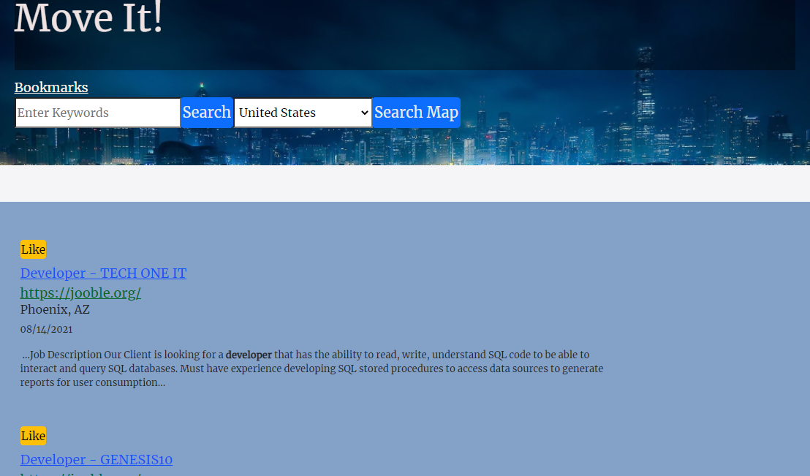

<!-- Move it! is a place where you can find your next job...
(elevator pitch) tech used (api, css)-->

# Move It!

## Table of Contents
* [Desciption](#desciption)
* [Deployed Page](#deployedPage)
* [Contributors](#contributors)
* [License](#license)


## Description
<!-- Move it! is a place where you can find your next job (elevator pitch)  ...
This app was created with Javascript, JQuery, Bootstrap, & Materialize.-->

```
I want to move to another city and search for a job in that city
I want to have the option to search for houses around that city
I want to use the search bar to select for the city i am interested in moving to
I want to have checkboxes to select for filters for job search
I want to be able to see on the map how close my work could be to my house
I want to be able to do this for multiple cities

When I go to this website
I want to move to another city
I want to search for a job based on the city I want to move to
I want to know the the housing prices based on the location I searched for 
```





## Live Link
[Github live URL] <https://nelliafc.github.io/HighLife/>
<!--this is where our github pages link  goes. Nellia needs to add it from the repo pages-->


## Collaboration

<!--name, role in project, github username  -->
```
Kyla Scott, created _________. username
Nellia Fleurova-Char, created Landing, job search results, comingsoon page with modal. neoneonilla
J Torres, created the javascript for the three APIs and search results. itorres60
Waleed Baig, created ________. username
Guillermo Bernal, created the bookmarks page and helped with the README.md . guillermobernal
```


## License


